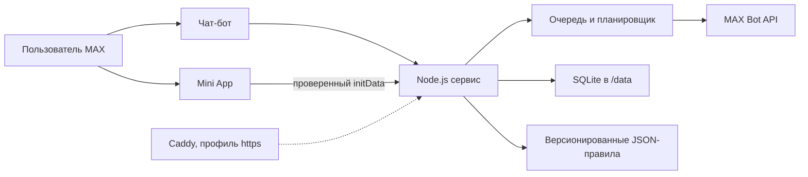

# Пятилетка

Личная карта прав и действий для работающего по найму гражданина РФ за пять лет до общеустановленного возраста страховой пенсии. Бот в MAX задаёт пять вопросов, показывает ориентировочные даты и ведёт по шагам; подключённое мини-приложение даёт общую карту, чек-лист и источники.

Расчёт справочный. Точный статус, дату и право подтверждает Социальный фонд России (СФР). Досрочные пенсии MVP не рассчитывает.

## Основной сценарий

1. Пользователь отправляет `/start` боту в MAX и нажимает `Составить план`.
2. Указывает пол, месяц и год рождения, регион, занятость и наличие досрочного основания.
3. Получает начало предпенсионного периода, налоговую границу и ориентировочную дату права.
4. Открывает `Что делать сейчас` или всю карту, читает шаг и официальный источник.
5. Отмечает шаг выполненным. Ежегодный шаг вернётся в новом году, а планировщик отправит недублирующееся напоминание.
6. При необходимости открывает ту же карту в Mini App, копирует текст работодателю или делится планом.

Профиль можно заполнить и для родителя. Это не отдельная роль: в расчёт нужно ввести данные человека, для которого составляется карта.

## Состав и архитектура



Один процесс Node.js обслуживает Bot API, webhook или polling, HTTP API Mini App, статику, напоминания и healthcheck. Подробности и границы доверия: [docs/architecture.md](docs/architecture.md).

## Быстрый запуск через Docker

Требуются Docker Engine 24+ с Compose v2, свободный порт 3000 и действующий токен бота MAX.

1. Подготовьте окружение:

   ```bash
   cp .env.example .env
   ```

2. Заполните в `.env` как минимум `BOT_TOKEN`, `BOT_USERNAME`, `EVENT_SALT` и `ADMIN_TOKEN`. Для случайных значений можно выполнить `openssl rand -hex 32`. Не добавляйте `.env` в Git.

3. Одна команда запускает все обязательные локальные компоненты:

   ```bash
   docker compose up --build -d
   ```

4. Проверьте `http://localhost:3000/healthz` и логи `docker compose logs -f app`.

Сборка использует `node:22-slim`, `npm ci --omit=dev`, не содержит нативных npm-модулей и запускает процесс от пользователя `node`. В среде разработки этапа P5 Docker daemon отсутствовал, поэтому фактическое время холодной сборки не измерено. На машине с Docker выполните `scripts/verify-docker.sh`; скрипт проверит сборку без кэша, non-root, TLS до MAX и, при наличии заполненного `.env`, healthcheck.

## HTTPS через Caddy

Укажите `DOMAIN` и `PUBLIC_BASE_URL=https://<домен>` в `.env`, направьте DNS на сервер и откройте TCP 80/443 и UDP 443. Запуск с опциональным профилем:

```bash
docker compose --profile https up --build -d
```

Caddy получает публичный сертификат и проксирует запросы в `app:3000`. Для локального polling Caddy не нужен. Mini App в MAX требует публичный HTTPS-адрес.

## Переменные окружения

| Переменная | Обязательность и значение |
|---|---|
| `BOT_TOKEN` | Обязательна для сервиса. Токен выданного бота MAX. |
| `BOT_USERNAME` | Нужна для кнопки Mini App и резервного диплинка, без `@`. |
| `EVENT_SALT` | Обязательный секрет от 16 символов для HMAC-обезличивания событий. |
| `SMOKE_USER_ID` | Только P6: локальный ID владельца из `/id` для явного `smoke:real -- --send`; приложение не читает. |
| `BOT_MODE` | `polling` для локальной проверки, `webhook` для production. По умолчанию `polling`. |
| `MAX_API_BASE` | База MAX API, по умолчанию `https://platform-api2.max.ru`. |
| `MAX_REQUEST_TIMEOUT_MS` | Таймаут запросов к MAX, по умолчанию 35000 мс. |
| `QUEUE_MIN_INTERVAL_MS` | Минимальный интервал исходящих сообщений, 500 мс означает не более 2 запусков/с. |
| `PORT` | Порт на хосте Compose; внутри контейнера сервис слушает 3000. |
| `DB_PATH` | Путь SQLite. Compose принудительно задаёт `/data/pyatiletka.sqlite`. |
| `NODE_EXTRA_CA_CERTS` | PEM bundle Минцифры. Compose задаёт `/app/certs/russian_trusted_ca.pem`. |
| `REMINDER_TZ` | Часовой пояс календаря напоминаний, по умолчанию `Europe/Moscow`. |
| `REMINDER_INTERVAL_SEC` | Период прохода планировщика, по умолчанию 900 секунд. |
| `REMINDER_FROM_HOUR`, `REMINDER_TO_HOUR` | Разрешённое окно отправки, по умолчанию 09:00-20:00. |
| `ANNUAL_REMINDER_DATES` | Даты годового напоминания в формате `ММ-ДД` через запятую. |
| `MINIAPP_ENABLED` | Включает кнопку запуска Mini App. По умолчанию `true`. |
| `INIT_DATA_MAX_AGE_SEC` | Максимальный возраст подписанного `initData`, по умолчанию 3600 секунд. |
| `ALLOW_DEMO_AUTH` | Только локальная демонстрация вне MAX. В `.env.example` и Compose выключена. |
| `DEMO_USER_ID` | Синтетический ID локального демо, по умолчанию 900000001. |
| `API_RATE_LIMIT` | Запросов внутреннего API на пользователя в минуту, по умолчанию 60. |
| `REQUEST_BODY_LIMIT_BYTES` | Максимальный JSON body, по умолчанию 16384 байта. |
| `REQUEST_TIMEOUT_MS`, `HEADERS_TIMEOUT_MS` | Таймауты HTTP-сервера, 10000 и 5000 мс. |
| `ADMIN_TOKEN` | Необязателен для работы пользователя, но нужен для закрытого `/api/stats`; минимум 16 символов. |
| `PUBLIC_BASE_URL` | Публичный HTTPS origin. Обязателен для настоящего webhook. |
| `WEBHOOK_PATH` | Путь callback, по умолчанию `/webhook`. |
| `WEBHOOK_SECRET` | Секрет webhook от 16 символов при `BOT_MODE=webhook` и заданном публичном URL. |
| `DOMAIN` | Домен Caddy в профиле `https`. |
| `ENV_FILE` | Альтернативный файл окружения для Compose, по умолчанию `.env`. |

## Порты

- `3000/tcp` - HTTP приложения и healthcheck; публикуется как `${PORT:-3000}`.
- `80/tcp`, `443/tcp`, `443/udp` - только опциональный профиль Caddy `https`.

Сервис не открывает порт SQLite и не требует отдельной базы данных.

## Зависимости

- Node.js >= 22.13.0; в контейнере `node:22-slim`.
- `@maxhub/max-bot-api` 0.3.1, зафиксирована в `package-lock.json`.
- Встроенный `node:sqlite`, поэтому компилятор и нативные npm-модули не нужны.
- Docker Engine и Docker Compose v2 для воспроизводимого запуска.
- Caddy 2.10.2 только для опционального HTTPS-профиля.

## Внешние сервисы и интеграции

| Сервис | Использование | Условия проверки |
|---|---|---|
| MAX Bot API | Команды, сообщения, callback, polling/webhook, подписки | Реальный `BOT_TOKEN`, исходящий HTTPS и сертификаты Минцифры |
| MAX Mini App/Bridge | Подписанный `initData`, навигация, haptic, share, ссылки | Привязанный к боту публичный HTTPS URL и клиент MAX |
| Госуслуги, СФР, ФНС, mos.ru | Только явные ссылки для пользователя | API-интеграции и чтение личных кабинетов отсутствуют |
| Caddy/ACME | TLS для собственного домена | DNS, открытые 80/443 и публично доступный сервер |

Внешний MAX нельзя воспроизвести внутри Docker. Без реального токена проверяются расчёты, Bot API на HTTP-mock, Mini App API и интерфейс.

## Данные и приватность

Нормативные и модельные правила лежат в `data/pension_age.json`, `data/rules.json`, `data/regions.json`; происхождение каждого утверждения описано в [docs/provenance.md](docs/provenance.md). Изменение JSON не требует изменения ядра, но обязательно требует `npm run check:data` и тестов.

SQLite хранит профиль, отметки, резервы напоминаний и обезличенные события. В Compose БД находится в `./data/pyatiletka.sqlite` благодаря тому `./data:/data`. Исходный MAX ID не выдаётся статистическим API; в событиях используется HMAC. Команда `/reset` удаляет пользовательские данные. Не используйте реальные медицинские данные: продукт их не запрашивает.

## Тестовые данные и запуск без токена

После установки Node.js 22 выполните:

```bash
npm ci
npm run check:data
npm run check:secrets
npm test
```

Тесты не читают `.env` и поднимают локальный HTTP-mock MAX. `data/testvectors.json` содержит граничные годы расчёта. Для просмотра Mini App в обычном браузере без токена:

```bash
npm run demo
```

Откройте `http://127.0.0.1:3000/?demo=1`. Скрипт создаёт только игнорируемую `data/demo.sqlite`; остановка - `Ctrl+C`. Если доступен pnpm вместо npm, эквивалентный чистый прогон: `pnpm install --lockfile=false`, затем `pnpm run check:data`, `pnpm run check:secrets`, `pnpm test`.

## Сценарий проверки для жюри

Перед проверкой команда передаёт жюри ссылку на работающего бота и commit hash отдельно от репозитория. Рабочий токен в Git не размещается.

1. Открыть бота в MAX и отправить `/start`.
2. Нажать `Составить план`, выбрать тестовый профиль: мужчина, апрель 1963, Москва, работа по трудовому договору, досрочной пенсии нет.
3. Убедиться, что бот показывает ориентировочную дату права `04.2028`, налоговую границу `04.2023` и дисклеймер СФР.
4. Открыть `Что делать сейчас`, затем карточку диспансеризации. Проверить шаги, дату источника и кнопку копирования текста работодателю.
5. Нажать `Готово`, вернуться в план и увидеть обновлённый прогресс; повторное открытие не должно терять состояние.
6. Открыть Mini App, проверить тот же профиль и прогресс, карточку шага, BackButton и тёмную тему.
7. Выполнить `/sources`, затем `/reset` и подтвердить удаление.
8. Для ветки ограничения повторить настройку с `Есть право на досрочную пенсию: Да`: сервис должен прекратить точные рекомендации по датам и направить в СФР.

## Проверка на реальном MAX

После добавления токена только в локальный `.env` выполните read-only preflight `npm run smoke:real`. Отправка тестовой карточки требует явного флага `npm run smoke:real -- --send` и локального `SMOKE_USER_ID`, полученного командой `/id`. Скрипт никогда не выводит токен или ID. Полная матрица A1-A10 для iOS, Android и web находится в [scripts/smoke-real.md](scripts/smoke-real.md).

## Примеры ожидаемого поведения

- Неверный ввод `13.1963` не принимается и сопровождается понятной подсказкой формата.
- Повторное нажатие старой callback-кнопки не портит профиль: бот предлагает продолжить текущий шаг.
- Ошибка 429 или 5xx MAX повторяется ограниченно с паузой; очередь продолжает обрабатывать другие сообщения.
- Одно напоминание не отправляется повторно после рестарта благодаря уникальному резерву SQLite.
- `/healthz` возвращает 200 только когда БД доступна и polling или webhook готов; иначе 503.
- `/api/stats` без корректного `ADMIN_TOKEN` не раскрывает агрегаты.

## Расширенное использование MAX

Основной сценарий целиком доступен в чате, а Mini App органично расширяет его картой и чек-листом. Используются `open_app` с link-fallback, HMAC-проверка `initData`, `BackButton`, `HapticFeedback`, `platform`, `shareContent`, `openMaxLink`, `openLink` и clipboard. Матрица проверки и ограничения клиентов описаны в [docs/max-features.md](docs/max-features.md). До ручной проверки P6 эти возможности подтверждены контрактными тестами и mock, но не объявляются проверенными в реальном MAX.

## Что модельное, а что нет

- Реально реализованы: Bot API клиент, polling/webhook, очередь, SQLite, Mini App, подпись `initData`, расчёт по версионированной таблице, напоминания, healthcheck и метрики.
- Нормативные факты: связаны с источником и датой проверки, но результат расчёта всё равно ориентировочный.
- Модельные данные: региональный пакет вне Москвы и неподтверждённые возрастные условия `Московского долголетия` явно помечены.
- Не имитируются: доступ к Госуслугам, СФР, ФНС, сведения о стаже, баллах, льготах и официальном статусе. Сервис даёт ссылки и порядок действий.
- Не используется LLM в юридически значимом ядре: одинаковый профиль всегда получает детерминированный результат из проверяемых правил.

## Сертификат Минцифры

MAX требует российскую доверенную цепочку. В `certs/russian_trusted_ca.pem` находятся публичные Russian Trusted Root CA и Russian Trusted Sub CA, полученные по ссылкам официальной страницы [Госуслуг](https://www.gosuslugi.ru/crt). Compose передаёт путь через `NODE_EXTRA_CA_CERTS`. Отпечатки, срок выпускающего сертификата и инструкция обновления находятся в [certs/README.md](certs/README.md).

Проверка файла и TLS до MAX без токена:

```bash
npm run check:certs
```

Если файл отсутствует, сервис завершается с явной ошибкой. Не отключайте TLS-проверку через `NODE_TLS_REJECT_UNAUTHORIZED=0`.

## Известные ограничения

- Для допуска нужен развернутый и доступный бот в MAX; репозиторий сам по себе этого не заменяет.
- Реальные iOS, Android, web MAX, токен, Mini App URL и доставка напоминаний требуют ручного этапа P6.
- Досрочные основания, размер пенсии и официальный статус не рассчитываются.
- Полноценный региональный пакет есть только для Москвы, и его возрастные условия ещё не подтверждены.
- Планировщик рассчитан на одну реплику с одной SQLite БД.
- Dockerfile и Compose валидированы статически, но сборка в текущей среде не выполнена: Docker daemon недоступен.

Полный список: [docs/known-limitations.md](docs/known-limitations.md). Внешние блокеры: [docs/blockers.md](docs/blockers.md).

## Остановка и повторный запуск

```bash
docker compose stop
docker compose start
```

Полное удаление контейнеров без удаления БД: `docker compose down`. Данные остаются в `./data`. Для удаления локальных тестовых данных остановите сервис и удалите только `data/pyatiletka.sqlite`, `data/pyatiletka.sqlite-shm` и `data/pyatiletka.sqlite-wal`. Файлы JSON не удаляйте.

После изменения `.env` выполните `docker compose up -d --force-recreate app`. Логи: `docker compose logs -f --tail=100 app`.

## Документация

- [Архитектура](docs/architecture.md)
- [Технические решения](docs/decisions.md)
- [Происхождение данных](docs/provenance.md)
- [Масштабирование](docs/scaling.md)
- [Возможности MAX](docs/max-features.md)
- [Известные ограничения](docs/known-limitations.md)
