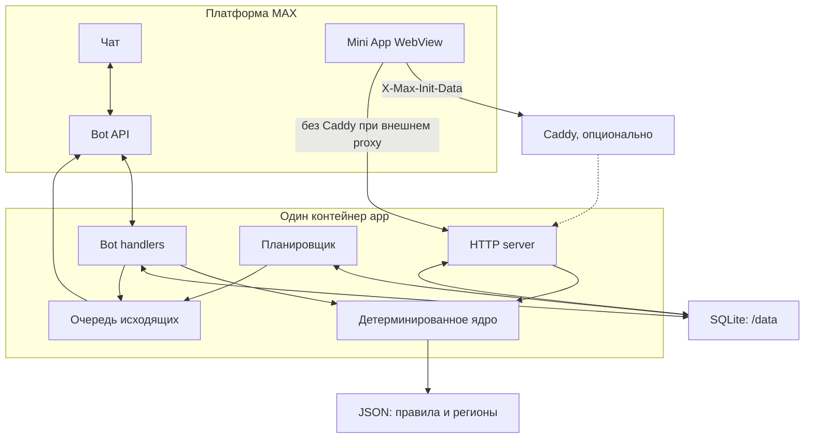

# Архитектура

Дата: 30.09.2026.

## Контекст

## Компоненты

| Компонент | Ответственность |
|---|---|
| `src/index.js` | Композиция сервиса, режим polling/webhook, graceful shutdown |
| `src/bot.js`, `src/texts.js` | Диалог, команды, клавиатуры и fallback кнопок MAX |
| `src/pension-age.js`, `src/rules.js` | Детерминированный расчёт и сборка плана из JSON |
| `src/server.js`, `public/*` | Mini App, внутренний API, статика, healthcheck и stats |
| `src/webapp-auth.js` | HMAC-проверка свежего `initData` до доверия к `user.id` |
| `src/db.js` | SQLite, схема, профили, отметки, напоминания и события |
| `src/queue.js`, `src/reminders.js` | Ограничение отправки, повторы, календарь и дедупликация |
| `data/*.json` | Версионированные правила, региональные пакеты и тест-векторы |

## Потоки

### Чат

MAX отдаёт update по long polling или webhook. Обработчик извлекает MAX ID из проверенного update, читает профиль, применяет JSON-правила, сохраняет переход и ставит ответ в очередь. На 429 и 5xx очередь выполняет не более трёх повторов с экспоненциальной паузой.

### Mini App

Браузер передаёт исходную строку `initData` в `X-Max-Init-Data`. Сервер проверяет HMAC, время и структуру, только затем использует `user.id`. API не доверяет ID из тела запроса. Статика и API имеют один origin, CORS не требуется.

### Напоминания

Планировщик работает в заданном часовом поясе и окне. До отправки он создаёт уникальный резерв `(user_id, task_id, period, bucket)`. Успех сохраняет резерв как защиту после рестарта; ошибка снимает его для следующей попытки.

## Границы доверия

- Доверенные после проверки: update от MAX SDK, подписанный свежий `initData`, локальные JSON из зафиксированного commit.
- Недоверенные: любой HTTP body, query, заголовок без подписи, callback payload, переменные окружения до валидации.
- Секреты поступают только через окружение. `.env` исключён из Git и Docker context.
- `ADMIN_TOKEN` защищает только агрегированную статистику и сравнивается без утечки значения.
- `NODE_EXTRA_CA_CERTS` добавляет конкретную публичную CA-цепочку; TLS-проверка не отключается.

## Хранение и восстановление

Обязательное состояние находится в одном SQLite-файле в `/data`. JSON и статика входят в образ. Для резервного копирования нужно остановить запись или использовать SQLite backup API, затем сохранить файл БД. При потере БД пользователь повторно создаёт профиль; нормативные данные не теряются.

## Масштаб одного экземпляра

Один экземпляр достаточен для MVP и исключает распределённую дедупликацию. Для нескольких реплик SQLite заменяется общей PostgreSQL, резерв напоминаний становится транзакционной очередью, а polling заменяется webhook. JSON-формат и пользовательский сценарий сохраняются.
